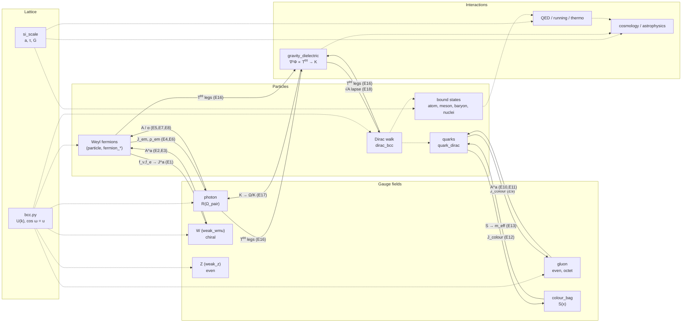

# CASIM Model Map — Overview

*2026-09-29 - 00:00. An equation-level map of `src/casim/`, read off the code. Each section file cites every equation as `file.py:L<n> function()`. This page is the one-page summary: what each sector models, its key equations, and how the sectors feed one another. Follow-ups (mismatches, superseded code, unregistered modules, unknown exactness) are listed in [`99-flags.md`](99-flags.md).*

**How to read the map.**

- **The code is the source of truth.** Where a docstring or finding says something else, both are recorded and flagged `⚠ DOC/CODE MISMATCH`.
- **Exactness follows ground rule 3 strictly.** A row carries a class only when it comes from the module registry, marked `(reg)`, or from a named `exactness-inventory.md` row. Otherwise the row reads `unknown`. Where the mapper had its own reading, it is kept as `unknown (inferred: …)`: information, not a claim. About half the registry's modules have no `exactness` set, so `unknown` is common. That is a registry gap, not a statement about the physics.
- **Symbols.** $c_\text{lat}=1/\sqrt3$, $\omega^\pm(\mathbf k)=\arccos u^\pm(\mathbf k)$, $u^\pm=c_xc_yc_z\pm s_xs_ys_z$ with $c_i=\cos(k_i/\sqrt3)$, $s_i=\sin(k_i/\sqrt3)$. $R(\Omega)$ is the rotation $(\tilde E,\tilde B)\mapsto(\cos\Omega\,\tilde E+\sin\Omega\,\tilde B,\;-\sin\Omega\,\tilde E+\cos\Omega\,\tilde B)$.

| File | Scope |
|---|---|
| [01-constants.md](01-constants.md) | `casim.constants` (D7): every registered constant as a closed form, with its provenance finding |
| [02-numerics.md](02-numerics.md) | `casim.numerics` (D8): FFT/linalg/rng/chiral primitives (plumbing) |
| [03-lattice.md](03-lattice.md) | `engine/lattice`: the BCC walk (canonical), D1 cubic/square references, block-spin, SI map, time/dimension derivations |
| [04-core.md](04-core.md) | `engine/core`: the tick loop, channels, exchange bus, clock, observers. **Channel coupling order and data flow** is its closing section |
| [05a](05a-gauge-actions-bilinear-colour.md) · [05b](05b-gauge-derivations-gluon-em.md) · [05c](05c-gauge-photon-lpt-weak.md) | `engine/gauge`: actions, σ-bilinear (W/Z/gluon), colour · SU(N) derivations, gluon, EM sourcing, hypercharge · photon, lattice PT, W/Z, strong |
| [06a](06a-particles-derivations-baryons.md) · [06b](06b-particles-fermions-bound-states.md) | `engine/particles`: lepton-shape/PMNS derivations, baryons · Dirac walks, CPT, bound states, nuclei, second quantisation |
| [07a](07a-interactions-cosmology.md) · [07b](07b-interactions-gravity-relativity.md) · [07c](07c-interactions-qed.md) · [07d](07d-interactions-quantum-information.md) · [07e](07e-interactions-running-thermo-astro.md) | `engine/interactions`: cosmology · gravity and relativity · QED · quantum information · running couplings, thermodynamics, astrophysics |
| [08a](08a-forks-gravity-core.md) · [08b](08b-forks-dark-sector-gauge-particles.md) | `engine/forks`: recorded alternatives, tested and rejected or live-exploratory |
| [09-shims.md](09-shims.md) | top-level compatibility packages `fields/ gravity/ lattice/ particles/`. **Five of them carry real, unregistered code** (notably `particles/channel.py`, which registers nine channels) |
| [99-flags.md](99-flags.md) | every flag, with file:line, plus the verification sample and pass rate |

---

## 1. Lattice (`03`)

The base layer is the **BCC Weyl quantum walk** (D1). One tick applies a $2\times2$ unitary per Fourier mode:

$$\psi_{t+1}=\mathcal F^{-1}U^\pm(\mathbf k)\,\mathcal F\,\psi_t,\qquad U^\pm=u^\pm\,\mathbb I-i\,\boldsymbol\sigma\cdot\tilde{\mathbf n}^\pm,\qquad \cos\omega^\pm(\mathbf k)=u^\pm(\mathbf k)$$

(`bcc.py:L263 weyl_step_3d_bcc`, `L122 bcc_dispersion`). The small-$k$ limit is $\omega\to c_\text{lat}\lvert\mathbf k\rvert$ with $c_\text{lat}=1/\sqrt3$, and the branches swap under $\mathbf k\to-\mathbf k$: $\omega^+(-\mathbf k)=\omega^-(\mathbf k)$.

- **Two length units.** The walk hops by $\mathbf d/\sqrt3$ on an ordinary cubic FFT grid. `geometry.py` uses integer hops $\mathbf d\in\{\pm1\}^3$. They describe the same crystal at a $\sqrt3$ change of unit. This is the most common source of $\sqrt3$ confusion downstream.
- **D1 references.** The simple-cubic and square cores (`core.py`, `core_exact.py`, `curved.py`, `geometry.cubic()/square()`) are continuum-limit regression targets, not canonical.
- **The SI map (`si_scale.py`).** $a=\sqrt{8\pi}\,3^{1/4}\,\ell_P$, $\tau=a/(c\sqrt3)$, and the structural Newton constant is $G=a^2c^3/(8\pi\sqrt3\,\hbar)$ (F79/F107). The strong sector is anchored separately by $f_\pi$.

## 2. Core engine (`04`)

`Simulation` steps channels **in declared YAML order** (Gauss–Seidel by default). Each channel reads its partners' state dicts by name from a shared `context`. The only exchange mechanism is that a consumer reads a partner's keys. The bus (`core/graph.py`) resolves edges by **channel name**, not by quantity. The documented contract is **gauge channel before its fermion**: the gauge field consumes the pre-tick fermion, and the fermion consumes the post-tick field in the same tick (F388). The clock (`core/clock.py`) reconciles $\Delta t$ and sub-cycling; under `legacy`, partners with different `dt` advance different physical times (F268).

## 3. Gauge (`05a–c`)

**Propagator classes, as the code implements them (F91):**

| Boson | Step | Law in code |
|---|---|---|
| photon | `gauge/photon.py:L105 photon_step_spectral` | **even**: $(\tilde E,\tilde B)\to R(\Omega_\text{pair})(\tilde E,\tilde B)$, $\;\Omega_\text{pair}(\mathbf k)=\omega^+(\mathbf k/2)+\omega^-(\mathbf k/2)$, the same scalar on all three components (non-birefringent) |
| W± massless | `gauge/weak_wmu.py:L912 w_propagation_step_chiral` | **chiral**: $F^\pm=\tilde E\pm i\tilde B$, $F^\pm\to e^{\mp i\Omega^\pm}F^\pm$, $\Omega^\pm=2\omega^\pm(\mathbf k/2)$ |
| W massive, Z, gluon | `weak_wmu._f26_rotation_step` (L688), `weak_z.py:L391/L408`, `gluon.py:L204` | **even**, massive: $\omega_\text{eff}=\sqrt{m^2+\Omega_\text{even}^2}$ |

The photon's $c=1/\sqrt3$ comes out of $\Omega_\text{pair}$ itself; the code imports no speed constant. In the dielectric the rate becomes $\Omega_K=\Omega_\text{pair}(\mathbf k)/K(x)$ (Strang, Weyl-ordered; `photon.py:L275`, F271). Discrepancies against decision 5 that the map records:

- the Z has **no** vector/axial split in code;
- the massive W runs on the even law;
- the β-decay pipeline propagates W⁻ with the even law;
- `charge_coupling.maxwell_curl_step` is labelled even, but it rotates by $\lvert C_\text{odd}\rvert$.

**No photon path uses the σ-bilinear construction.** `bilinear.py` feeds only derivations, forks and historical tests.

**Minimal coupling** (`minimal_coupling.py`):

- U(1) wrap: $\psi'=e^{+iq\alpha}\,\mathrm{BCC}[e^{-iq\alpha}\psi]$.
- Per-link Peierls step: $\psi'=\sum_d e^{iq\,c_\text{lat}\mathbf A\cdot\mathbf d}M_d\,\mathrm{shift}_{\mathbf d/\sqrt3}\psi$.
- SU(2) site-average covariant step: $U_\text{eff}=\sum_\ell U_\ell/\lVert\sum_\ell U_\ell\rVert$.
- SU(3) rotate-then-step: $q\to e^{i\varepsilon A^aT^a}q$.

**Hypercharge (decision 3).** It is a pure-gauge angle $\alpha(x)$ carried inside $U(x)$ in the mass step, $D(\alpha)=\mathrm{diag}(e^{i\alpha\Delta Y/2})$ (`hypercharge.py`). It has no dynamics of its own and there is no Higgs field.

**Sources.**

- W: $E\leftarrow R_\text{chiral}E+g\,J^a$ with $J^a=\bar f\tfrac{\tau^a}2 f$.
- Z: $E_Z\mathrel{+}=g_ZJ_Z\,dt$ with $J^Z=J^3-s_W^2J^\text{em}$.
- Gluon: $E^a\leftarrow R_\text{even}E^a+g\,dt\sum J^a_\text{colour}$.

## 4. Particles (`06a–b`)

**The canonical massive fermion is the BCC Dirac walk** (`dirac_bcc.py:L123`):

$$D_\mathbf k=\begin{pmatrix}nA_\mathbf k & im\\ im & nA_\mathbf k^\dagger\end{pmatrix},\qquad n=\sqrt{1-m^2},\qquad \cos\omega_\mathbf k=n\,u(\mathbf k),\qquad \omega(0)=\arcsin m .$$

A second massive walk, inside `weak_wmu`, pairs the Weyl block with the opposite branch; only `dirac_bcc` carries the CPT theorem (F378). The variable-mass (confinement) Strang step appears to rotate opposite to the main step; see the flags.

**Lepton shape (decision 7).** $\delta^*=2/9$ is primary, and $\lambda_6$ is an output:

$$\lambda_6=\frac{\lvert B\rvert}{2e^6\cos(3\delta^*)},\qquad 3\delta^*=\tfrac23$$

(`derive_lambda6_sextic.py:L132`). No module fits $\lambda_6$. However, the registered $\lambda_6=0.243$ is **not reproduced** by this formula evaluated with the registry's own $e$ (0.2334). The code gets 0.2433 only with $e=\sqrt3\,\bar y$ from PDG masses.

Bound states follow from these walks plus the exchange edges below: atoms, positronium, mesons (NJL), baryons, and nuclei (A-body variational).

## 5. Interactions (`07a–e`)

- **Gravity (`07b`).** `gravity.py` implements the **static weak-field reduction** of the F178 induced-Einstein law:
  $$\nabla^2\Phi=\tfrac{\kappa c_0^2}{2}T^{00},\qquad \ln K=-2\Phi/c_0^2,\qquad K=e^{2u},\ A=1/K,\ B=K,$$
  with $G_\text{lat}=c_\text{lat}^4/(8\pi)=1/(72\pi)$ and $8\pi G/c^4\to1$ in lattice units (`gravity.py:L293`). Signs and $4\pi/8\pi$ factors agree with the ledger; the numerical residual is $10^{-15}$.
  - Matter couples through the lapse mix, rotating $\eta\leftrightarrow\chi$ by $\theta=-(\sqrt A-1)m\,dt/2$.
  - Light couples through $\Omega/K$.
  - The full-tensor interior law is *not* in code.
- **Cosmology (`07a`).** BBN, growth, transfer function, Λ-sector studies, and primordial and holographic bounds. `blackhole.py`'s horizon-free F114 solution is **SUPERSEDED by F178**.
- **QED (`07c`).** Mostly continuum formulas with $\alpha$ and the lepton masses typed in. Lattice content is limited to:
  - the subtracted photon-kernel checks;
  - the Casimir pair-dispersion sums;
  - the UV-completion legs, whose regulator is the simple-cubic Wilson reference, not BCC.
- **Quantum information (`07d`).** Entanglement registers, Born/Gleason, Bell–Tsirelson, cluster decomposition, measurement and noise.
- **Running, thermodynamics, astrophysics (`07e`).**
  - Running couplings: $\alpha_s$, the NJL gap, scale ratios.
  - Thermodynamics and $g_*$.
  - Superconductivity.
  - Stellar structure, Tolman, ray-tracing, QNMs.
  - Several of the astrophysics modules map F114/energy-only models **SUPERSEDED by F178**.

## 6. Forks (`08a–b`)

The recorded alternatives (52 registry entries in sector `forks`): gravity (the F46–F79 derivation chain, the F64 EM-connection/dielectric route, and the dark-sector F164–F248 forks), electroweak, gauge, lattice smearing, dark matter, and particles. They preserve the falsification record. The map records each fork's status and marks superseded forms. For example, the F64 impedance checks still run on the excluded $K=(1-u)^{-2}$, while the live code uses $e^{2u}$.

---

## Physics flow

Solid arrows are runtime exchange edges on the engine bus (cited in `04-core.md` §"Channel coupling order", edges E1–E19). Dashed arrows are build-time or derivation dependencies: one module's output is another's input, with no channel involved.

**Tick order within a coupled pair.** In each pair the gauge channel is stepped first and consumes the pre-tick matter; the matter then consumes the updated field in the same tick. Only declared YAML order enforces this; the bus checks names, not quantities. The pairs are:

- W ⇄ doublet
- EM photon ⇄ charged fermion
- gluon ⇄ quark
- colour bag ⇄ confined quark
- gravity ⇄ massive Dirac

Channels with no context edges run stand-alone:

- the free steps `weyl_bcc`, `w_chiral`, `z_even` and `gluon_bcc`;
- `charge_photon` and `beta_decay`;
- the Monte-Carlo and refraction channels;
- the spectral-matter channels (NJL, string tension);
- the five quantum-register channels.

`two_grid_atom` and `element_atom` run a private inner loop.
